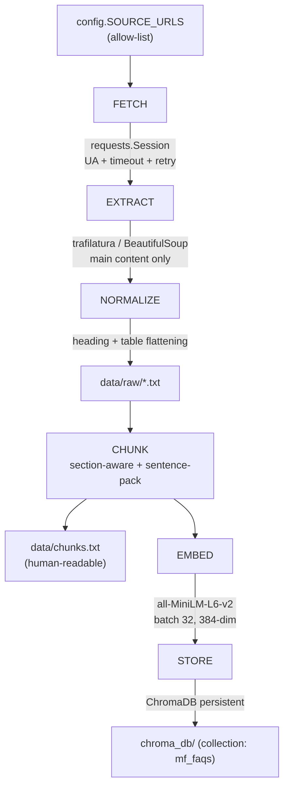
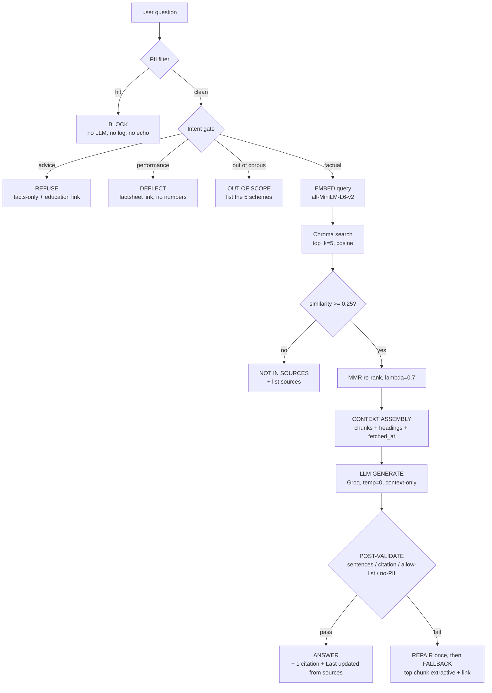

# ARCHITECTURE.md — Mutual Fund Facts-Only RAG Chatbot

**Derived from:** `PRD.md` v1.0
**Status:** Draft v1.0
**Last updated:** 2026-09-28
**Scope note:** Covers both mandatory RAG stages from the brief — **Data Ingestion** and **Data Retrieval** — plus the safety/answering layer that sits between them.

> **Naming:** file is `ARCHITECTURE.md` to match the all-caps style of `PRD.md`, `README.md`, `CHUNKING.md`, `SOURCES.md`. On Windows/macOS the case does not matter.

---

## 1. Architecture Goals

| # | Goal | Consequence for the design |
|---|---|---|
| A1 | Both RAG stages are explicit and separately runnable | `ingest` is a **command**, not a startup step |
| A2 | Every answer is traceable to a chunk that exists on disk | Deterministic citation check, not LLM-trust |
| A3 | No personal data ever reaches the LLM vendor | Guard stage runs **before** embedding and **before** logging |
| A4 | Reviewer can read the whole query path in one sitting | Hand-built pipeline, no framework indirection (ADR-1) |
| A5 | Failure is visible, never papered over with a fabricated answer | Explicit "not in sources" path + degraded offline mode |
| A6 | Zero per-restart ingestion cost | Chroma persisted to disk; app never re-embeds |
| A7 | Ingestion is reproducible and inspectable | Raw text + `chunks.txt` committed; chunking versioned |

---

## 2. System Context

```
        ┌────────────────────────────┐
        │        User / Reviewer     │
        │   (Streamlit browser UI)   │
        └─────────────┬──────────────┘
                      │ question / click
                      ▼
┌─────────────────────────────────────────────────────────────┐
│                  LOCAL MACHINE (demo laptop)                 │
│                                                             │
│  ┌──────────┐   ┌──────────┐   ┌───────────┐   ┌─────────┐ │
│  │  UI      │──▶│  GUARDS  │──▶│ RETRIEVAL │──▶│  LLM    │ │
│  │ (app.py) │   │(guards.py│   │(retrieve  │   │(answer  │ │
│  └──────────┘   │  .py)    │   │  .py)     │   │  .py)   │ │
│                 └──────────┘   └─────┬─────┘   └────┬────┘ │
│                                       │              │      │
│                                 ┌─────▼─────┐   ┌────▼────┐ │
│                                 │  ChromaDB │   │  Groq   │─┼──▶ internet
│                                 │ ./chroma_db│   │   API   │ │
│                                 └───────────┘   └─────────┘ │
│                                                             │
│  OFFLINE (run once, before the demo)                         │
│  ┌───────────────────────────────────────────────────────┐  │
│  │ ingest.py : FETCH → NORMALIZE → CHUNK → EMBED → STORE │  │
│  └───────────────────────────────────────────────────────┘  │
│  artifacts: data/raw/*.txt , data/chunks.txt                │
└─────────────────────────────────────────────────────────────┘
                      ▲
        ┌─────────────┴──────────────┐
        │  5 scheme URLs + official  │
        │  reference pages (public)  │
        └────────────────────────────┘
```

**Trust boundary:** everything inside the box is local and inspectable. The only egress is the Groq call, and the guard stage guarantees only guard-approved, non-PII text crosses it.

---

## 3. Component Inventory

| Component | File | Responsibility | Stage |
|---|---|---|---|
| Configuration | `config.py` | Paths, model ids, thresholds, URL allow-list, prompt text. Single source of truth. | Both |
| Ingestion | `ingest.py` | Fetch → extract → normalize → chunk → embed → persist | **1** |
| Guard stage | `guards.py` | PII filter, intent gate, performance gate | 2 (pre) |
| Retrieval | `retrieve.py` | Query embedding, Chroma search, score floor, MMR, context assembly | **2** |
| Answering | `answer.py` | Prompt build, Groq call, answer contract, post-validation | 2 (post) |
| UI | `app.py` | Streamlit shell, chat history, citation rendering, disclaimer | 2 |
| Artifacts | `data/raw/`, `data/chunks.txt`, `chroma_db/` | Cache, human-readable chunks, vectors | 1 |
| Tests | `tests/` | Guard, contract, and end-to-end sample-QA checks | Both |

**Dependency rule (one direction only):**

```
config ← ingest
config ← guards
config ← retrieve
config ← answer
guards → answer → retrieve → config
app   → guards, answer
```

`ingest.py` must never import `answer.py` or `guards.py`. If it does, the stages have leaked into each other.

---

## 4. Stage 1 — Data Ingestion

**Runs once**, offline, before the demo. Command: `python -m ingest`.

### 4.1 Pipeline



### 4.2 Step-by-step contract

| Step | Input | Output | Failure behaviour |
|---|---|---|---|
| **1. FETCH** | `config.SOURCE_URLS` (5 scheme pages + official refs) | `list[FetchedPage]` | Per-URL try/except. Failures collected and **printed in a summary at the end**; a page under 300 words is a hard warning, not a silent skip (FR-1). |
| **2. EXTRACT** | Raw HTML | Main-content text only | Strip `script/style/nav/header/footer/aside`, cookie banners, ad containers. Prefer `trafilatura`; fall back to `soup.get_text()`. |
| **3. NORMALIZE** | Extracted text | Markdown-ish text with `#`/`##` heading markers; tables flattened to `Field: Value` lines | Collapse runs of whitespace; preserve line-per-fact. |
| **4. CHUNK** | Normalized text | `list[Chunk]` | Minimum 25-word chunks dropped. Overlap applied at sentence boundaries only. Enforce the 256-token cap here (see §4.4). |
| **5. DUMP** | `list[Chunk]` | `data/chunks.txt` | Always written, even on partial failure, so the corpus is always inspectable (FR-3). |
| **6. EMBED** | `list[str]` chunk texts | `ndarray (n, 384)` float32 | Batch size 32. Assert `n` matches, assert no all-zero vectors. |
| **7. STORE** | Vectors + ids + metadata | `chroma_db/` collection `mf_faqs` | `upsert`, not `add`, so re-runs are idempotent (FR-7). |

### 4.3 Chunk record (internal)

```python
@dataclass
class Chunk:
    text: str
    source_url: str
    page_title: str
    heading_path: str      # "Fees and charges > Expense ratio"
    scheme_name: str
    scheme_category: str   # large_cap | flexi_cap | elss | small_cap | balanced_advantage
    source_type: str       # scheme_page | factsheet | faq | charges | education
    chunk_index: int
    char_start: int
    char_end: int
    content_hash: str      # sha1 of normalized text
    fetched_at: str        # ISO-8601 with +05:30
```

### 4.4 The 256-token constraint (critical)

`all-MiniLM-L6-v2` has `max_seq_length = 256` tokens. A chunk longer than that is **silently truncated by the tokenizer** — the tail never reaches the vector, so the facts in it become unretrievable, with no error anywhere.

Therefore, in `ingest.py`:

```python
MAX_EMBED_TOKENS = 256
TARGET_CHUNK_TOKENS = 200   # headroom for token/word ratio variance

def assert_chunk_fits(chunk_text: str, tokenizer) -> None:
    n = len(tokenizer.encode(chunk_text))
    assert n <= MAX_EMBED_TOKENS, f"chunk too long: {n} tokens (max {MAX_EMBED_TOKENS})"
```

`tests/test_contract.py` re-checks every chunk in `data/chunks.txt` against the real tokenizer. This is R8 from the PRD.

### 4.5 Chroma collection schema

```python
client = chromadb.PersistentClient(path="./chroma_db")
collection = client.get_or_create_collection(
    name="mf_faqs",
    metadata={"hnsw:space": "cosine"},   # so distance -> similarity is 1 - d
    embedding_function=None,             # WE embed; Chroma must not
)
```

- `embedding_function=None` is deliberate: we produce 384-dim vectors with sentence-transformers and pass them in explicitly. Leaving Chroma's default in place would either double-embed or fail on dimension mismatch (ADR-2).
- **Chroma metadata accepts only `str | int | float | bool`** — no lists, no `None`, no nested objects. Every field in §4.3 is therefore coerced to a string or int at write time, and a `None` becomes `""`.
- **IDs are deterministic and content-derived:** `f"{scheme_slug}::{chunk_index:03d}"`. With `upsert`, a re-run updates in place instead of duplicating.
- `data/raw/` is the fetch cache. If it is populated, `--offline` ingestion re-chunks from cache — this makes the demo reproducible without network.

### 4.6 Ingestion CLI

```
python -m ingest                  # fetch (or use cache) -> chunk -> embed -> upsert
python -m ingest --force          # wipe collection and rebuild from scratch
python -m ingest --offline        # skip network, use data/raw/ only
python -m ingest --inspect        # print chunk stats + write chunks.txt, no embedding
```

`--inspect` exists so M1 (PRD §17) can be completed — inspect the data, write `CHUNKING.md`, review `chunks.txt` — **before** any embedding code is exercised.

---

## 5. Stage 2 — Data Retrieval + Answering

Runs per user question.

### 5.1 Pipeline



### 5.2 Guard stage — `guards.py`

Three gates, in this order. **All are rule-first and run before the query is embedded**, so rejected input never reaches the LLM (C2) and never produces output.

```python
def run_guards(question: str) -> GuardDecision:
    if pii_scan(question).hit:
        return GuardDecision("block", PII_MESSAGE)          # C2
    intent = classify_intent(question)
    if intent is ADVICE:       return GuardDecision("refuse", ADVICE_REFUSAL)   # C4
    if intent is PERFORMANCE:  return GuardDecision("deflect", FACTSHEET_MSG)   # C3
    if intent is OUT_OF_CORPUS:return GuardDecision("out_of_scope", SCHEME_LIST)
    return GuardDecision("allow", None)
```

**PII patterns** (PRD §12.1), all must be checked before anything is logged:

| Pattern | Regex sketch |
|---|---|
| PAN | `\b[A-Z]{5}[0-9]{4}[A-Z]\b` |
| Aadhaar | `\b[0-9]{4}\s?[0-9]{4}\s?[0-9]{4}\b` |
| Account / folio | `\b[0-9]{8,18}\b` |
| OTP | `\b[0-9]{4,6}\b` near `otp\|one time\|verification code` |
| Email | `[A-Za-z0-9._%+-]+@[A-Za-z0-9.-]+\.[A-Za-z]{2,}` |
| Phone | `(\+91[\s-]?)?\b[6-9][0-9]{9}\b` |

**Intent gate** is keyword/regex-based (ADR-3): advice verbs, performance terms, and a scheme-name allow-list check. Rationale: it is deterministic, instant, and easy to demonstrate to a reviewer — a reviewer can read the regex and predict the outcome, which is worth more in a milestone demo than a smarter classifier.

**Logging rule:** user input is never written raw. If a decision needs a log line, log a SHA-256 prefix and the decision code only.

### 5.3 Retrieval — `retrieve.py`

```python
def retrieve(question: str, top_k: int = 5,
             score_floor: float = 0.25, mmr_lambda: float = 0.7,
             history: Sequence[str] = ()):          # FR-18 memory window
    resolved, scheme = resolve_question(question, history)
    q_vec = embed_model.encode([_expand_query(resolved)], normalize_embeddings=True)[0]
    res = collection.query(
        query_embeddings=[q_vec.tolist()],
        n_results=top_k * 3,              # over-fetch for MMR headroom
        include=["documents", "metadatas", "distances"],
        **({"where": {"scheme_category": scheme}} if scheme else {}),
    )
    # cosine space => similarity = 1 - distance
    hits = [Hit(doc, meta, 1.0 - dist) for doc, meta, dist in zip(...)]
    hits = [h for h in hits if h.similarity >= score_floor]
    if not hits:
        return RetrievalResult(hits=[], confident=False)     # -> "not in sources"
    return RetrievalResult(hits=mmr(hits, top_k, mmr_lambda), confident=True)
```

**Why the over-fetch + MMR:** the five schemes have near-identical field labels ("Expense ratio", "Exit load"), so a plain top-5 frequently returns five chunks from the same page. Fetching 15 and applying Maximal Marginal Relevance keeps the set diverse, which matters because the answer is capped at 3 sentences (C5) and can only cite one source (C6).

`mmr()` is a ~15-line greedy implementation. ChromaDB has no built-in MMR, and adding a vector-search framework just for it would break A4.

**Query expansion (added in Phase 5, measured, not guessed).** Terse topic queries
("Exit load?") score ≈ 0.12–0.22 against a 50-token chunk even when the chunk
*literally* contains the phrase, because the short query vector is diluted by the
chunk's other `Field: Value` tokens — while a junk embedding ("asdfghjkl nonsense
query") sits at ≈ 0.16. No single `SCORE_FLOOR` separates them. `retrieve()` therefore
expands the question with the corpus's own canonical labels and section headings when it
mentions a topic (`config.QUERY_ALIASES`): "Exit load?" → "Exit load? Exit load charges
and fees", which measures 0.35 against the right chunk and leaves junk untouched (no
alias fires). The expansion is used for the **query embedding only**; the LLM is always
asked the user's original question. Deterministic and reviewable (ADR-3). Alias matches
were verified against all six core-fact topics plus the three junk probes, and live in
`config.py` as the single source of truth.

**Same model on both sides** is non-negotiable: chunks and queries must use the identical `all-MiniLM-L6-v2` encoder instance. Mismatched embedding spaces degrade retrieval silently — no error, just wrong chunks. Both stages therefore import the encoder from a single accessor in `config.py`.

### 5.4 Context assembly

```python
def build_context(hits: list[Hit]) -> tuple[str, str]:
    blocks = [
        f"[SOURCE {i}] {h.meta['page_title']} — {h.meta['heading_path']}\n"
        f"URL: {h.meta['source_url']}\nFETCHED: {h.meta['fetched_at']}\n"
        f"{h.text}"
        for i, h in enumerate(hits, 1)
    ]
    newest = max(h.meta["fetched_at"] for h in hits)
    return "\n\n---\n\n".join(blocks), newest
```

The `FETCHED` line is what makes the `Last updated from sources:` stamp honest — it is appended to the answer **by code** (`newest`), never written by the LLM, so the model cannot invent a date (C7).

### 5.5 Generation — `answer.py`

```python
resp = client.chat.completions.create(
    model=config.GROQ_MODEL,          # explicit, pinned — never an alias default
    messages=[
        {"role": "system", "content": config.SYSTEM_PROMPT},
        {"role": "user",   "content": f"{context}\n\nQUESTION: {question}"},
    ],
    temperature=0,
    max_tokens=250,
)
```

**System prompt rules** (mirror the answer contract in PRD §11):

1. Answer **only** from `[SOURCE n]` blocks. If the answer is not there, say so.
2. **1 to 3 sentences.** No preamble, no bullet lists, no closing offers.
3. End with exactly one line: `Source: <url>` using a URL that appears in a SOURCE block.
4. Never compute, compare, or state a return/performance figure. Never say "you should".
5. Never repeat personal identifiers, even if they appear in context.

**Post-validation is deterministic code, not another LLM call** (ADR-6). Checks, in order:

| Check | Rule | On failure |
|---|---|---|
| Sentence count | ≤ 3, using a decimal-safe splitter | truncate, then re-validate |
| Citation count | exactly 1 `http` URL in the answer | re-prompt once |
| Citation allow-list | domain ∈ `config.ALLOWED_DOMAINS` **and** URL present in the retrieved `hits` | re-prompt once |
| Performance language | no return/CAGR/ranking claim in a factual answer | replace with the factsheet deflect |
| PII echo | answer contains anything the input filter would have blocked | drop answer, use fallback |

**Decimal-safe sentence splitting** — a naive `text.split(".")` breaks `"1.16% p.a."` into fragments and would mis-report sentence count. Split on:

```python
_SENT = re.compile(r'(?<=[.!?])\s+(?=[A-Z"\'(\[])|\n{2,}')
```

**Fallback path (A5):** if validation still fails after one repair, return the highest-ranked chunk's first two sentences plus its URL and timestamp, labelled as extracted source text. Always better to show raw source than a bad answer.

### 5.6 Degraded / offline mode (R6)

Retrieval is fully local, so if the Groq call fails (no key, rate limit, no network), the app must not look broken. It returns the extractive fallback with a visible notice:

> "Answer generation is unavailable right now — here is the matching text from the source page, with the link."

This also satisfies NFR-5 and gives the demo a working fallback if the API fails mid-run.

---

## 6. UI Architecture — `app.py`

Streamlit, deliberately thin: **no retrieval logic in the UI file.**

| Element | Source | Notes |
|---|---|---|
| Layout | `layout="centered"` + `_CSS` | One narrow column, pill composer, pill starter chips. Presentation only — the stylesheet cannot change what is stored or what a guard decided |
| Title | Literal | "HDFC Mutual Funds", with `New chat` on the right once a transcript exists |
| Greeting | Literal, inside `st.chat_message("assistant")` | Opening assistant turn, so the first thing on screen has the same shape as every later turn. Hidden once the transcript is non-empty |
| Disclaimer note | `DISCLAIMER.md` summary literal | One caption inside the greeting (FR-19) |
| Funds in scope | `_scope_line()`, built from `config.SOURCE_URLS` | Generated, never hand-written, so the list cannot drift from the ingested corpus |
| 3 example questions | `st.button` × 3 | Starter chips, first screen only. Click submits the query (FR-22) |
| Disclaimer | `DISCLAIMER.md` verbatim, in a collapsed expander | Always present. Open on the first screen, collapsed after, so FR-20 survives a long conversation. The one-line heading under the title is the persistent, non-dismissible part |
| Chat history | `st.session_state.messages` | Stores answer text + citation + sources. Never stores raw rejected input. |
| Answer body | `answer.py` result | Rendered as-is |
| Citation | The single URL | Hyperlinked, source title as the label |
| `Last updated from sources:` | Computed by `answer.py` | Rendered in muted small text |
| Sources expander | `retrieval.hits` metadata | Shows source page + heading path per retrieved chunk (FR-17) |
| Refusal block | Pre-formatted strings from `guards.py` | Distinct styling so refusals are obvious in the demo |
| `New chat` | `on_click=_clear_transcript` | Empties the transcript only; leaves `pending` alone so it cannot swallow an in-flight question |

There is no sidebar. The one thing it used to hold that mattered — the missing-`GROQ_API_KEY`
warning — moved to the main screen and renders nothing when the key is set, so a working
setup shows no banner.

### 6.1 Turn rendering order

`_ask` runs in a fixed order, and it is load-bearing:

1. `guards.run_guards`. Regex only, so it costs nothing perceptible.
2. If refused, echo the question and render the refusal. `block` is the one silent action,
   because the input is itself the problem.
3. Draw the user message.
4. Draw a spinner, then call `answer_question` behind it.
5. Clear the spinner, store the turn, draw the answer.

Steps 1–2 come before step 3 on purpose. Drawing the question immediately is what makes the UI
feel responsive, but it would also echo a pasted PAN back into the transcript and break C2.
`run_guards` is fast enough that running it first costs the user nothing.

Step 4 exists because retrieval plus generation takes seconds. Rendering only at the end made a
working turn indistinguishable from a hung page.

`test_blocked_input_is_never_echoed_into_the_transcript` pins step 1–2. It fails if the user
message is drawn first — verified by deliberately reordering `_ask` and watching it go red.

**Starter chips are offered once, at the top, and never again.** They sit above the greeting
and disappear after the first turn. Two details make that work:

- The chip click is delivered by an `on_click` callback, not by a return value. A button read
  with `if st.button(...)` must still be rendered later in the same run to report `True` — and
  the run that processes a chip is precisely the run that stops rendering them, so a naive
  version loses the click that unmounted it.
- The `opened` session flag, not `messages`, records that the opening screen has been used. A
  refusal stores no turn, so `messages` alone cannot distinguish "never asked" from "asked and
  refused", and the chips would reappear on the next interaction. `New chat` resets it.

The composer is read *before* the opening screen is decided, so the run that answers a typed
question does not also draw the chips and greeting above that answer.

Covered by `test_a_starter_chip_is_honoured_even_though_its_own_click_hides_it`,
`test_the_starter_chips_are_offered_once_at_the_top`,
`test_a_refused_question_does_not_bring_the_chips_back` and
`test_a_blocked_question_leaves_the_opening_screen_alone`.

**Caching** (NFR-2, NFR-9): `@st.cache_resource` for the embedding model, the Chroma client, and the Groq client. Ingestion is *not* cached — it is a separate command; the app only opens the existing collection and shows a clear error if it is missing ("Run `python -m ingest` first").

**Gotcha — docstrings are user-visible here.** Streamlit evaluates a bare string expression that
follows a module-level assignment and renders it as page markdown. A constant written as

```python
DISCLAIMER_HEADING = "**Facts-only. No investment advice.**"
"""The one line PRD FR-20 requires to be persistently visible."""
```

puts that second paragraph on the page, above the title, where a user reads it. A *module*
docstring is unaffected, and so is a docstring inside a function. So: `#` comments for
module-level constants, real docstrings everywhere else.
`tests/test_contract.py::test_app_module_has_no_bare_strings_that_streamlit_would_render`
fails the build if a constant docstring comes back.

---

## 7. Configuration Surface — `config.py`

Every tunable in one place, so no threshold is a magic number buried in logic.

```python
EMBED_MODEL   = "sentence-transformers/all-MiniLM-L6-v2"   # exact id: MiniLM-L6, capital L
EMBED_DIM     = 384
CHROMA_PATH   = "./chroma_db"
COLLECTION    = "mf_faqs"
RAW_DIR       = "./data/raw"
CHUNKS_TXT    = "./data/chunks.txt"

CHUNK_TARGET_WORDS   = 200
CHUNK_MAX_WORDS      = 220
CHUNK_OVERLAP_PCT    = 0.20
CHUNK_MIN_WORDS      = 25

TOP_K          = 5
SCORE_FLOOR    = 0.25
MMR_LAMBDA     = 0.7
MEMORY_TURNS   = 10                           # FR-18 follow-up window

GROQ_MODEL     = os.environ["GROQ_MODEL"]      # pinned explicit id
GROQ_API_KEY   = os.environ["GROQ_API_KEY"]    # never logged, never in git

SOURCE_URLS        = [...5 scheme urls...]     # PRD Appendix A
ALLOWED_DOMAINS    = {"groww.in", "hdfcamc.com", "amfiindia.com", "sebi.gov.in"}
SUPPORTED_SCHEMES  = {...5 scheme names...}
```

`GROQ_MODEL` is an explicit pinned id, not a provider alias — aliases change what they point at, which would make the demo non-reproducible (PRD OQ-5). Verify the id against the Groq model list at build time.

---

## 8. Error Handling & Failure Modes

| Failure | Detected at | Behaviour | User sees |
|---|---|---|---|
| Source page unreachable | Ingest step 1 | Log + continue; summary at end | n/a (build-time) |
| Page extracted < 300 words | Ingest step 2 | Warn loudly | n/a (build-time) |
| `chroma_db/` missing | App startup | Stop with instructions | "Run `python -m ingest` first" |
| `GROQ_API_KEY` missing | Generation | LLM step skipped → fallback | Degraded-mode notice (§5.6) |
| Groq 429 / timeout | Generation | One retry, then fallback | Degraded-mode notice |
| No chunk above score floor | Retrieval | Return `confident=False` | "I couldn't find that in the source pages" + sources list |
| PII in input | Guard 1 | Hard block, no LLM, no log | Please-don't-share message |
| Advice / performance query | Guard 2 | Refuse / deflect | Facts-only wording + education link |
| Chunk > 256 tokens | Ingest assertion | Fail the build | n/a — a test asserts this (§4.4) |

**Invariant:** no path in this system produces an answer without a source link. If a link is unavailable, the system says it does not know.

---

## 9. Security & Privacy

| Control | Implementation |
|---|---|
| Secrets | `.env` only; `.env` gitignored; `.env.example` committed with blanks; key read once in `config.py` and never printed (C8) |
| PII never leaves the device | Guard stage precedes embedding **and** generation; blocked input is not logged and not stored in `st.session_state` (C2) |
| No PII at rest | Nothing user-typed is persisted. Only `data/raw/` (public pages) and `chroma_db/` (public page chunks) are written |
| Egress minimization | Only guard-approved question + retrieved public chunks reach Groq. No user identity, no account context |
| Source allow-list | Ingestion and citation validation both check `config.ALLOWED_DOMAINS` (C1) |
| Logging | Decision codes + hashed question prefix only; never raw input, never the API key |

---

## 10. Performance Budget

| Path | Budget | Mechanism |
|---|---|---|
| App startup (warm) | < 3 s | `st.cache_resource` on model + client; collection opened read-only |
| App startup (cold) | < 20 s | Model download/load once; acceptable pre-demo |
| Query embedding | < 50 ms | 384-dim, single sentence, local |
| Chroma search | < 20 ms | ~hundreds of chunks; HNSW is overkill but free |
| Context assembly + prompt build | < 5 ms | pure string work |
| Groq call | 1–3 s | external; dominant term |
| **Total query** | **< 5 s** (NFR-1) | |

Optional 2nd-order MMR, query rewriting, and hybrid BM25 + vector search are deliberately **excluded** — see §13.

---

## 11. Test Architecture

Tests target the deterministic layers; the LLM is exercised only through the end-to-end sample-QA script.

| Test | Layer | Asserts |
|---|---|---|
| `test_guards.py` | `guards.py` | All 6 PII patterns block; advice verbs refuse; performance terms deflect; the 5 scheme names pass; a known out-of-scope scheme is caught |
| `test_contract.py` | `answer.py` | ≤ 3 sentences (decimal-safe), exactly 1 citation, citation in allow-list, `Last updated from sources:` present, no PII echo |
| `test_chunks.py` | `ingest.py` | Every chunk in `data/chunks.txt` ≤ 256 real tokens; all metadata fields non-null; chunk count matches the collection |
| `test_retrieval.py` | `retrieve.py` | "ELSS lock-in" retrieves the lock-in chunk; a nonsense query returns `confident=False` |
| `run_sample_qa.py` | end-to-end | Runs the 9 queries from PRD Appendix D, regenerates `sample_qa.md`, and re-checks the contract on each answer |

PII tests are the highest-priority ones: a single failure is a PRD constraint breach.

---

## 12. Traceability Matrix

| PRD ref | Component | §  |
|---|---|---|
| C1 public sources only | `config.ALLOWED_DOMAINS`, ingest allow-list, citation validator | 4.2, 5.5, 7 |
| C2 no PII | `guards.run_guards` (gate 1) | 5.2 |
| C3 no performance claims | Guard gate 2 (deflect) + prompt rule 4 | 5.2, 5.5 |
| C4 no advice | Guard gate 2 (refuse) | 5.2 |
| C5 ≤ 3 sentences | Prompt rule 2 + post-validator | 5.5 |
| C6 exactly one citation | Prompt rule 3 + post-validator | 5.5 |
| C7 last-updated stamp | `build_context` → `newest` | 5.4, 5.5 |
| C8 key in `.env` | `config.py` + `.gitignore` | 7, 9 |
| FR-1 – FR-7 | Ingestion | 4 |
| FR-8 – FR-11, FR-16 | Retrieval + answering | 5.3 – 5.5 |
| FR-12 – FR-15 | Guard stage | 5.2 |
| FR-17 | UI sources expander | 6 |
| FR-18 multi-turn | UI session history + pronoun resolution in prompt | 6, 13 |
| FR-19 – FR-22 | UI | 6 |
| R1 stale values | `fetched_at` stamp + "verify on factsheet" disclaimer | 5.4, App. B |
| R2 source policy | `config.ALLOWED_DOMAINS` + README note | 7 |
| R4 weak numeric retrieval | Table→`Field: Value` flattening before chunking | 4.2 step 3 |
| R6 Groq failure | Degraded mode | 5.6 |
| R8 256-token truncation | `assert_chunk_fits` + `test_chunks.py` | 4.4, 11 |

---

## 13. Architecture Decisions (ADR summary)

| # | Decision | Rationale | Consequence |
|---|---|---|---|
| ADR-1 | Hand-built pipeline, no LangChain/LlamaIndex | Brief specifies the pipeline exactly; reviewers can read the whole path (A4) | ~600 lines of plumbing we own; no opaque framework version risk |
| ADR-2 | Embed outside Chroma (`embedding_function=None`) | We already have sentence-transformers; letting Chroma also embed would double the work or mismatch dimensions | Vectors are passed explicitly; Chroma is a dumb store |
| ADR-3 | Rule-first guards, not an LLM router | Deterministic, instant, and demonstrable to a reviewer | Regexes need maintenance; acceptable for a fixed demo query set |
| ADR-4 | Ingestion is a separate command, never on app startup | Ingestion is expensive; A6 requires zero re-embed on restart | One extra setup step, documented in README |
| ADR-5 | Single AMC, 5 schemes, Direct Growth | Keeps the corpus small enough to be verified by hand | Out-of-corpus questions answered with a scope message |
| ADR-6 | Deterministic post-validation instead of a second LLM call | LLM self-checks are unreliable; regexes are not (A2) | Truncation/repair logic to write (~40 lines) |
| ADR-7 | Over-fetch + greedy MMR for diversity | Near-identical scheme pages collapse a plain top-5 | ~15 extra lines, materially better context |
| ADR-8 | Cache raw text in `data/raw/` and support `--offline` ingest | Reproducible builds; de-risks the live demo (R3) | Raw public page text committed to the repo |

### Deliberately excluded (scope discipline)

Deferred on purpose: hybrid BM25 + vector search, query rewriting, cross-encoder reranking, conversational memory beyond the last turn, multi-document synthesis, agentic multi-hop retrieval, any vector DB other than ChromaDB, any hosted embedding service. Each would be defensible as a "v2"; none is required by the brief, and each adds a failure mode to a demo that must work on an unfamiliar laptop.

---

## 14. Build Order

Implements PRD §17 M1 → M7, with the file each step produces.

| Step | Produces | Gate before moving on |
|---|---|---|
| 1 | `config.py`, `.env.example`, `.gitignore`, `requirements.txt` | App shell imports cleanly |
| 2 | `ingest.py` steps 1–5, `data/raw/`, `data/chunks.txt` | **`CHUNKING.md` written and chunks reviewed by a human (M1 exit)** |
| 3 | `ingest.py` steps 6–7, `chroma_db/` | Query for "ELSS lock-in" returns the lock-in chunk |
| 4 | `retrieve.py` | Top-k + score floor + MMR behave as specified |
| 5 | `answer.py` | 3/3 contract checks pass on factual queries |
| 6 | `guards.py`, `tests/test_guards.py` | All PII patterns block; advice refused |
| 7 | `app.py` | First screen shows the disclaimer note + 3 examples; heading stays visible every rerun |
| 8 | `tests/run_sample_qa.py` → `sample_qa.md`, README, SOURCES, DISCLAIMER | All 12 PRD §19 acceptance criteria pass |

Steps 2 and 3 are the critical path. Steps 5 and 6 are the constraints that must not be traded away for time.

---

## 15. Open Architectural Questions

| ID | Question | Recommendation |
|---|---|---|
| AQ-1 | Confirm the source-policy resolution from PRD OQ-1 (Groww as primary + official cross-check) | Yes; encode in `config.ALLOWED_DOMAINS` and state in README |
| AQ-2 | Multi-turn: pass full history to the LLM, or only rewrite the question? | Only rewrite the question with the last scheme name; keeps prompts small and citations accurate (FR-18) |
| AQ-3 | Should the score floor (0.25) be tuned per demo run? | Measure on the 9 sample queries once, hard-code the value, note it in `CHUNKING.md` — no runtime tuning |
| AQ-4 | Store the raw HTML or just extracted text? | Extracted text only; keeps the repo small and avoids redistributing page markup |
| AQ-5 | Pin which Groq model id? | Pin explicitly in `config.py` after verifying the live model list; do not rely on an alias |

---

*Next artifacts: `CHUNKING.md` (after inspecting `data/raw/`, before embedding), then `README.md`, `SOURCES.md`, `sample_qa.md`, `DISCLAIMER.md`.*
